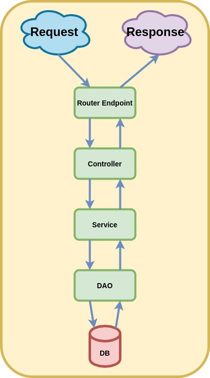

# Knex.js & Postgres

## Contents

<!-- toc -->

- [Knex.js & Postgres](#knexjs--postgres)
  - [Contents](#contents)
  - [Intro & Resources](#intro--resources)
  - [Case Sensitivity Reminder](#case-sensitivity-reminder)
  - [Code Architecture](#code-architecture)
    - [Why both DAO & Service layer](#why-both-dao--service-layer)
  - [DB setup](#db-setup)
  - [knexfile.js](#knexfilejs)
  - [Migrations](#migrations)
    - [Create Migration File, `knexfile.js`](#create-migration-file-knexfilejs)
    - [File Anatomy](#file-anatomy)
    - [Running Migrations](#running-migrations)
      - [Path Update](#path-update)
      - [Possible Issues with `dotenv` and `knexfile`](#possible-issues-with-dotenv-and-knexfile)
    - [Migration Tables](#migration-tables)

<!-- tocstop -->

## Intro & Resources

Learning knex.js with postgres & express. There is no FE for this project

This tutorial has no request body validation

- [Youtube Tutorial](https://www.youtube.com/watch?v=wfrn21E2NaU)
- [knex.js,sql query builder](https://knexjs.org/)
- [request body validation](https://www.youtube.com/watch?v=GfHsb6zPugo)

## Case Sensitivity Reminder

> `Important:` With Databases always use underscores (snake case) when for naming purposes, never Pascal/Camel Case. Cause sometimes DBs can be case insensitive and that can cause tons of issues. I think camel case in nosql document keys are fine though.

## Code Architecture

Code logic/concerns are separated in separate folders

1. `routes`
   1. express endpoints
2. `db`
   1. migrations
      1. db table schema(s) can found here
      2. run it initially to create/migrate the dbs
      3. see migrations section below
   2. postgreDB.js
      1. grants access to the db through an export `db` object
   3. knexfile
      1. access info for the db
3. `controller`
   1. Using classes (not required), helpful incase we need to do dependancy injection
   2. If we want want we can access the `db` object from here
   3. But the controller is not supposed to have direct access to the `data layer`
   4. Hence we have a service layer
   5. `Note:` The controller is just responsible for receiving the request and delgating it to the service layer and communicate any errors that might have occured
4. `service`
   1. The service layer is the one who actually has the logic and knows what to do
5. `dao` (data access object)
   1. The dao object/layer is basically there to abstract away the db access
   2. So different DB backends can be used, cause our service doesn't care what underlying DB we are using. We could have different ones in the db folder.
   3. If we have to switch the `DB` then we only have to modify this



### Why both DAO & Service layer

[Service layer vs DAO -- Why both?](https://softwareengineering.stackexchange.com/questions/220909/service-layer-vs-dao-why-both)

## DB setup

```bash
# start psql server
sudo su - postgres

# start psql from server (I guess)
# brings up postgres CLI
postgres@ssaquif-thinkpad-t430:~$ psql

# create DB & grant permissions
postgres=# CREATE DATABASE knex_tutorial;
CREATE DATABASE
postgres=# GRANT ALL PRIVILEGES ON DATABASE knex_tutorial to ssaquif;
GRANT
postgres=# \q;

# logout
postgres@ssaquif-thinkpad-t430:~$ logout
```

## knexfile.js

Is basically where you put all your connection info, I put it in my `db` folder

Run following to create it

```bash
npx knex init
# move it to db folder after creation
```

Default file looks like this. Assumes there is a development, staging & a production db.

We want `postgres` for our dev db.

```js
// Default file that is created, uses sqlite for dev db
module.exports = {
  development: {
    client: "sqlite3",
    connection: {
      filename: "./dev.sqlite3",
    },
  },

  staging: {
    client: "postgresql",
    connection: {
      database: "my_db",
      user: "username",
      password: "password",
    },
    pool: {
      min: 2,
      max: 10,
    },
    migrations: {
      tableName: "knex_migrations",
    },
  },

  production: {
    client: "postgresql",
    connection: {
      database: "my_db",
      user: "username",
      password: "password",
    },
    pool: {
      min: 2,
      max: 10,
    },
    migrations: {
      tableName: "knex_migrations",
    },
  },
};
```

## Migrations

For the titroal we will have a very simple migration with 1 table, person

### Create Migration File, `knexfile.js`

Had to run the following command from same folder as where my `package.json` resides

```bash
# named our first migration init
# set default migrations dir to be db/migrations
npx knex migrate:make init --migrations-directory db/migrations
```

### File Anatomy

Gives you 2 functions

```js
// up applies the migration
exports.up = function (knex) {};
// down undoes the migration
exports.down = function (knex) {};
```

### Running Migrations

Run it from the root of the project where my `package.json` and `.env` files are located

```bash
# migrate:latest means it will check the DB
# check which migrations have already run
# & then if it is not there, it will run it
# finally specify where the knexfile is using the switch, --knexfile
npx knex migrate:latest --knexfile db/knexfile.js
```

> `Important:` When we run migrations as above, the working dir changes as shown in the terminal msg

```bash
Working directory changed to ~/Programming/Database-Projects/knex-postgres/db
Using environment: development
Batch 1 run: 1 migrations
```

So I updated the path to the `.env` file for the `dotenv` package in the `knexfile.js`

```js
require("dotenv").config({ path: "../.env" });
```

#### Path Update

Updated config path to run from both db directory or root dir

1. presently works from db dir (used during migration)
2. have not tested root dir, which I expect is what will be used when running via express
   1. TODO: YES the else is needed

```js
if (process.cwd().includes("/db")) {
  dotenv.config({ path: "../.env" });
} else {
  dotenv.config();
}
```

#### Possible Issues with `dotenv` and `knexfile`

Now the above check is not the best, ie if some other part of the path contains the substring `/db`, the connection to db will fail. This could be the case for other computers

A possible solution is to simply put the `knexfile.js` in the project's `root` folder and only have
the following there and remove the conditional

Personally I like keeping the `knexfile` in the `db` folder, since it only concerns the db

`TODO:` Will try to come up with a more fullproof solution

```js
require("dotenv").config();
```

### Migration Tables

In addition to the `person` table created by this example, migrations also create 2 more tables. See video for more info.

1. `knex_migrations`
   1. Tracks migrations history
2. `knex_migrations_lock`
   1. Provides mutex so that mutiple users can run migrations simultaneously

##
